# 软件设计文档

<!-- TOC -->

- [软件设计文档](#软件设计文档)
    - [0 版本变更历史](#0-版本变更历史)
    - [1 概述](#1-概述)
        - [1.1 系统概述](#11-系统概述)
        - [1.2 参考资料](#12-参考资料)
        - [1.3 引用文档](#13-引用文档)
        - [1.4 术语与缩写词](#14-术语与缩写词)
        - [1.4 运行环境](#14-运行环境)
            - [1.4.1 硬件需求](#141-硬件需求)
            - [1.4.2 支持软件需求](#142-支持软件需求)
    - [2 系统总体设计](#2-系统总体设计)
        - [2.1 系统总体架构](#21-系统总体架构)
            - [2.1.1 前端层](#211-前端层)
            - [2.1.2 表现层](#212-表现层)
            - [2.1.3 代理层](#213-代理层)
            - [2.1.4 业务层](#214-业务层)
            - [2.1.5 访问层](#215-访问层)
        - [2.2 系统用户角色](#22-系统用户角色)
    - [3 系统详细设计](#3-系统详细设计)
        - [3.1 Web 前端设计](#31-web-前端设计)
        - [3.2 系统后端设计](#32-系统后端设计)
        - [3.3 子系统设计](#33-子系统设计)
            - [3.3.1 判题机设计](#331-判题机设计)
        - [3.4 关键业务流程设计](#34-关键业务流程设计)
            - [3.4.1 用户管理功能](#341-用户管理功能)
                - [功能点 1：用户认证管理](#功能点-1用户认证管理)
                    - [功能描述](#功能描述)
                    - [执行流程](#执行流程)
                    - [流程图](#流程图)
                - [功能点 2：个人信息管理](#功能点-2个人信息管理)
                    - [功能描述](#功能描述-1)
                    - [执行流程](#执行流程-1)
                    - [流程图](#流程图-1)
                - [功能点 3：用户权限管理](#功能点-3用户权限管理)
                    - [功能描述](#功能描述-2)
                    - [执行流程](#执行流程-2)
                    - [流程图](#流程图-2)
            - [3.4.2 题库功能](#342-题库功能)
                - [功能点 4：题目浏览与提交](#功能点-4题目浏览与提交)
                    - [功能描述](#功能描述-3)
                    - [执行流程](#执行流程-3)
                    - [流程图](#流程图-3)
                - [功能点 5：题目与题解管理](#功能点-5题目与题解管理)
                    - [功能描述](#功能描述-4)
                    - [执行流程](#执行流程-4)
                    - [流程图](#流程图-4)
            - [3.4.3 论坛功能](#343-论坛功能)
                - [功能点 6：论坛互动](#功能点-6论坛互动)
                    - [功能描述](#功能描述-5)
                    - [执行流程](#执行流程-5)
                    - [流程图](#流程图-5)
                - [功能点 7：论坛内容管理](#功能点-7论坛内容管理)
                    - [功能描述](#功能描述-6)
                    - [执行流程](#执行流程-6)
                    - [流程图](#流程图-6)
            - [3.4.4 AI 辅助功能](#344-ai-辅助功能)
                - [功能点 8：LLM 交互功能](#功能点-8llm-交互功能)
                    - [功能描述](#功能描述-7)
                    - [执行流程](#执行流程-7)
                    - [流程图](#流程图-7)
            - [3.4.5 公共功能流程设计](#345-公共功能流程设计)
                - [前后端交互公共流程](#前后端交互公共流程)
                - [权限控制](#权限控制)
                - [异常处理通用规则](#异常处理通用规则)
    - [4 数据库设计](#4-数据库设计)
        - [4.1 ER 图设计](#41-er-图设计)
        - [4.2 物理数据模型](#42-物理数据模型)
            - [4.2.1 User（用户）](#421-user用户)
            - [4.2.2 Follow（用户关注列表）](#422-follow用户关注列表)
            - [4.2.3 Question（题目）](#423-question题目)
            - [4.2.4 TestCase（测试用例）](#424-testcase测试用例)
            - [4.2.5 QuestionTag（题目标签）](#425-questiontag题目标签)
            - [4.2.6 QuestionTagMap（题目标签映射）](#426-questiontagmap题目标签映射)
            - [4.2.7 Record（提交记录）](#427-record提交记录)
            - [4.2.8 Language（编程语言）](#428-language编程语言)
            - [4.2.9 Solution（题解）](#429-solution题解)
            - [4.2.10 SolutionTag（题解标签）](#4210-solutiontag题解标签)
            - [4.2.11 SolutionTagMap（题解标签映射）](#4211-solutiontagmap题解标签映射)
            - [4.2.12 SolutionLike（题解点赞）](#4212-solutionlike题解点赞)
            - [4.2.13 SolutionComment（题解评论）](#4213-solutioncomment题解评论)
            - [4.2.14 Discussion（讨论）](#4214-discussion讨论)
            - [4.2.15 DiscussionLike（讨论点赞）](#4215-discussionlike讨论点赞)
            - [4.2.16 DiscussionComment（讨论评论）](#4216-discussioncomment讨论评论)
    - [5 系统部署设计](#5-系统部署设计)
        - [5.1 服务器配置](#51-服务器配置)
            - [5.1.1 生产环境](#511-生产环境)
            - [5.1.2 开发与测试环境](#512-开发与测试环境)
        - [5.2 网络拓扑](#52-网络拓扑)
        - [5.3 安全性设计](#53-安全性设计)
        - [5.4 监控与报警](#54-监控与报警)
            - [5.4.1 监控指标：](#541-监控指标)
            - [5.4.2 报警机制：](#542-报警机制)
            - [5.4.3 工具：](#543-工具)
        - [5.5 部署流程](#55-部署流程)

<!-- /TOC -->

## 0 版本变更历史

<table>
<tr>
<td><b>版本号</b> </td><td><b>变更时间</b> </td><td><b>修改人</b> </td><td><b>详情</b> </td></tr>
<tr>
<td>1.0.0 </td><td>2025.4.20 </td><td>马介平 </td><td>参考《GJB 438C-2021 军用软件开发文档通用要求》编写了大纲，并依照软件需求规格说明书完成2.3系统用户角色 </td></tr>
<tr>
<td>1.0.1 </td><td>2025.4.22 </td><td>裴子祎 </td><td>完成软件设计文档1概述部分 </td></tr>
<tr>
<td>1.0.2 </td><td>2025.4.23 </td><td>胡楠 </td><td>完成文档3.2系统后端设计、3.3子系统设计 </td></tr>
<tr>
<td>1.0.3 </td><td>2025.4.23 </td><td>张皓然 </td><td>完成文档2.1系统总体架构 </td></tr>
<tr>
<td>1.0.4 </td><td>2025.4.24 </td><td>马介平 </td><td>完成文档3.4关键功能设计 </td></tr>
<tr>
<td>1.0.5 </td><td>2025.4.24 </td><td>窦友川 </td><td>完成文档5系统部署设计 </td></tr>
<tr>
<td>1.0.6 </td><td>2025.4.24 </td><td>魏祎 </td><td>完成文档3前端设计 </td></tr>
<tr>
<td>1.1.0 </td><td>2025.5.8 </td><td>张皓然 </td><td>将2.3节修改为2.2节，完成文档4数据库设计，调整格式 </td></tr>
</table>

## 1 概述

### 1.1 系统概述

本系统名为“DeepCode——基于大语言模型的算法学习平台”，是一个 AI 辅助的在线编程平台。它具备登录、注册、编写代码、发布题解、创建题目、发表帖子和进行讨论等功能。我们的目标是为学生、算法爱好者及广大程序员提供一个卓越的学习和实践环境。DeepCode 不仅提供了安全的测评机制，还搭建了一个交流学习的平台，并集成了大语言模型接口，以提升用户体验和学习效果。

### 1.2 参考资料

根据本文档性质，依照下列文件编写本文档：

- GB/T 19003-2008 软件工程 [https://openstd.samr.gov.cn/bzgk/std/newGbInfo?hcno=F3D59D13EF49BE133CE9CB99FACDAED5](https://openstd.samr.gov.cn/bzgk/std/newGbInfo?hcno=F3D59D13EF49BE133CE9CB99FACDAED5)
- GB/T 9385-2008 计算机软件需求规格说明 [https://openstd.samr.gov.cn/bzgk/gb/newGbInfo?hcno=2790825C43AD0B69E3C38C140BFFCFE6](https://openstd.samr.gov.cn/bzgk/gb/newGbInfo?hcno=2790825C43AD0B69E3C38C140BFFCFE6)
- GB/T 8567-2006 计算机软件文档编制规范 [https://openstd.samr.gov.cn/bzgk/gb/newGbInfo?hcno=84C42B6277D2714B7176B10C6E6B1A44](https://openstd.samr.gov.cn/bzgk/gb/newGbInfo?hcno=84C42B6277D2714B7176B10C6E6B1A44)
- GJB 438B-2009 军用软件开发文档通用要求 [https://std.nscmi.com/pages/StdDataMore.aspx?id=364c3774fc8dc6f186f96b981f64cdba&isLogin](https://std.nscmi.com/pages/StdDataMore.aspx?id=364c3774fc8dc6f186f96b981f64cdba&isLogin)=
- GJB 438C-2021 军用软件开发文档通用要求 [https://img.antpedia.com/standard/files/pdfs_ora/20230331/GJB%20438C-2021.pdf](https://img.antpedia.com/standard/files/pdfs_ora/20230331/GJB%20438C-2021.pdf)
- Vue 参考文档：[https://vuejs.org/tutorial](https://vuejs.org/tutorial)
- SpringBoot 参考文档：[https://docs.spring.io/spring-boot/index.html](https://docs.spring.io/spring-boot/index.html)
- mysql 参考文档：[https://dev.mysql.com/doc/](https://dev.mysql.com/doc/)
- UML 规范：[https://www.omg.org/spec/UML/2.5.1/PDF](https://www.omg.org/spec/UML/2.5.1/PDF)

### 1.3 引用文档

- B 组_DeepCode_软件需求规格说明书软件需求规格说明书_v1.3.0

### 1.4 术语与缩写词

<table>
<tr>
<td>编号 </td><td>术语/缩写词 </td><td>说明 </td></tr>
<tr>
<td>1 </td><td>RUCM </td><td>限制性用例模型 </td></tr>
<tr>
<td>2 </td><td>Vue  </td><td>Vue.js 是一款易学易用，性能出色，适用场景丰富的 Web 前端框架 </td></tr>
<tr>
<td>3 </td><td>SpringBoot  </td><td>Spring Boot是用于创建微服务的基于Java的开源框架。 </td></tr>
<tr>
<td>4 </td><td>AI </td><td>Artifical Intelligence的缩写，即为人工智能。 </td></tr>
<tr>
<td>5 </td><td>LLM </td><td>Large Language Model（大语言模型），指能够处理自然语言任务的人工智能模型。 </td></tr>
<tr>
<td>6 </td><td>UC </td><td>Use Case（用例），用于描述系统功能的交互场景。 </td></tr>
</table>

### 1.4 运行环境

#### 1.4.1 硬件需求

- 处理器：8 核以上，主频 2.4GHz 以上
- 内存：32GB 以上。
- 硬盘：4TB 以上。
- 网络：支持千兆以上网络。

#### 1.4.2 支持软件需求

- 操作系统：支持 Windows、Linux、其他主流操作系统。
- Web 浏览器：Microsoft Edge、Chrome、Opera、Safari、Firefox 及任何支持 HTML5 标准的浏览器。
- 软件需求：

  - **Java Development Kit (JDK)** version: 21-LTS
  - **MySQL** version: 5.7.44
  - **Redis** version: 7.4.6
  - **Node.js** version: 18.3 或更高版本
  - **Spring Boot** version: 3.1.2
- 其他工具：

  - **Apache JMeter** version: 5.6.13

## 2 系统总体设计

### 2.1 系统总体架构

DeepCode 系统从前端到后端的交互主要分为五个层次，分别是前端层、表现层、代理层、业务层以及访问层，在此之后是后端的一些细节实现。

#### 2.1.1 前端层

- Vue3：用于构建用户界面的主要框架。

  - Vuex：Vue 的状态管理模式和库。
- TypeScript：一种静态类型的编程语言，是 JavaScript 的超集，有助于编写更清晰和易于维护的代码。
- Vue Router：Vue.js 官方的路由管理器。
- Eslint：一个用于识别和报告 JavaScript 代码中的问题的工具，旨在使代码更加一致并避免错误。
- Ant Design Vue (antd-vue)：蚂蚁金服开发的企业级 UI 设计语言 Ant Design 的 Vue 实现版本。
- Webpack：一个模块捆绑工具，主要用于打包 JavaScript 文件以及处理各种资源。
- Axios：一个基于 Promise 的 HTTP 客户端，用于浏览器和 Node.js。

#### 2.1.2 表现层

- Vue 模板渲染引擎：负责将数据渲染为 HTML 视图。
- 路由控制：通过 Vue Router 实现不同页面之间的导航与控制。
- Ajax 交互：包括 GET、POST、PUT、DELETE 等方法，用于前后端的数据交互。

#### 2.1.3 代理层

- Nginx 反向代理：提高网站运行效率和安全性，分发客户端请求至不同的后端服务器。

#### 2.1.4 业务层

- Spring Boot：简化了新 Spring 应用的初始搭建以及开发过程。
- Lombok：减少样板代码的 Java 库，通过注解实现。
- MybatisPlus：MyBatis 增强工具包，简化开发，提高效率。
- Swagger：API 开发工具，支持整个 API 生命周期的管理。
- JWT：JSON Web Token，用于安全地传输信息。
- Sandbox：提供安全执行环境，限制代码访问权限。
- SMTP：简单邮件传输协议，用于发送电子邮件。
- Interceptor：拦截器，可以动态拦截 Action 调用的对象。

#### 2.1.5 访问层

- WebFlux：Spring5 推出的响应式编程模型，处理异步请求。
- 线程池：优化服务器性能，合理分配资源。

### 2.2 系统用户角色

DeepCode 系统的用户主要分成注册用户、非注册用户（游客）、管理员三类，下面进行详细介绍。

<table>
<tr>
<td><b>角色名称</b> </td><td><b>权限</b> </td></tr>
<tr>
<td>注册用户 </td><td>注册用户指已经在DeepCode系统中完成注册账号，并能够使用注册账号正常登录的用户。这类用户能够实现编写代码提交测评、查看题解、发布题目、发布题解、与AI进行交互、参与论坛讨论、查看和修改个人信息等功能。 </td></tr>
<tr>
<td>非注册用户（游客） </td><td>非注册用户（游客）指尚未在DeepCode系统中注册账号的用户，这部分用户只能浏览题目不能浏览题解也不能编写代码提交测评，可以浏览论坛帖子但不能参与讨论。 </td></tr>
<tr>
<td>管理员 </td><td>管理员是指能够对注册用户和软件平台进行管理的用户。他们能够实现注册用户的全部功能，并且能够实现用户管理、论坛管理、题目管理。 </td></tr>
</table>

## 3 系统详细设计

### 3.1 Web 前端设计

DeepCode 系统采用前后端分离架构，前端基于 Vue3 框架构建，通过 RESTful API 与后端交互。

前端整体架构分为以下核心模块：

- 核心框架：Vue3（渐进式框架，支持组件化开发）
- 语言与工具：TypeScript 用于增强代码类型安全与可维护性，ESLint 用于代码规范检查与静态分析
- 工程化支持：Webpack 用于模块打包与资源优化，Vue CLI 用于项目脚手架与开发环境配置
- 状态管理：Vuex（全局状态管理，支持异步操作）
- 路由管理：vue-router（单页面应用路由控制）
- UI 组件库：Ant Design Vue（antdv），提供标准化 UI 组件（如表格、表单、按钮等）
- 编辑器组件：CodeMirror 代码编辑器，用于支持语法高亮与多语言适配；wangEditor 富文本编辑器，用于题解与讨论内容的编辑
- 数据可视化：ECharts（图表渲染，用于用户统计信息展示）
- 网络请求：Axios（HTTP 客户端，封装请求拦截与响应处理）
- 部署与优化：Nginx（反向代理与静态资源分发）

前端进行如此技术选型的依据主要基于各个工具的优点与系统特点的适配性：Vue3 支持 Composition API，可以提升代码复用性与逻辑组织能力，并且采用响应式系统优化，使得性能更高；TypeScript 的静态类型检查减少运行时错误，适合团队协作；Ant Design Vue 可以提供丰富企业级 UI 组件，加速开发；CodeMirror 与 wangEditor 可以分别满足代码编辑与富文本编辑需求，功能扩展性强；Webpack 的模块化打包支持 Tree Shaking，优化生产环境体积。

下图展示了前端系统的分层架构：
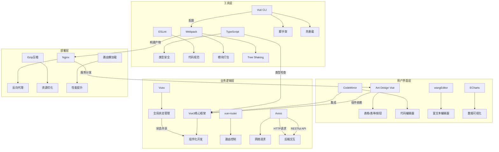

关键交互关系为：
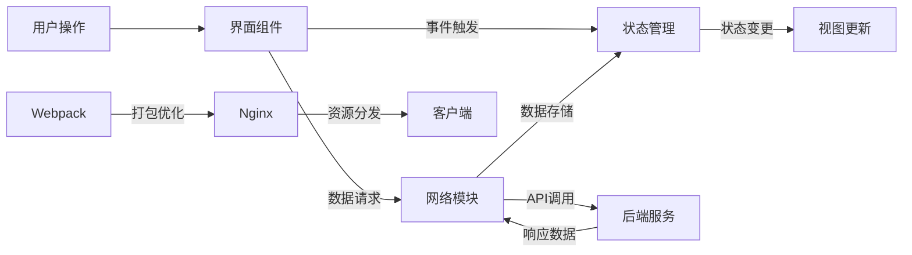

### 3.2 系统后端设计

DeepCode 后端采用 Spring Boot 框架进行开发，实现了基于 RESTful API 的接口服务。在接收到前端发送的请求之后，首先通过过滤器进行权限认证，采用 JWT 技术保障用户身份安全。在业务层，将服务划分成用户、题目、题解、论坛等多个模块。同时，通过 SMTP 提供邮件服务，通过 LangChan4j 调用 LLM 服务，通过 HTTP 请求调用判题服务。在数据持久层，使用 MySQL 存储 DeepCode 中的相关数据（例如：用户、题目、题解、论坛等信息）。使用 Redis 作为缓存，存储一些临时数据和高频访问数据。使用 MinIO 提供对象存储服务，保存图像、测试用例等文件。此外，在开发阶段，使用 Swagger 工具进行接口文档管理，以便于进行前后端接口调试。DeepCode 整体的后端架构如下图所示：

### 3.3 子系统设计

#### 3.3.1 判题机设计

判题机系统主要包括两个部分：JudgeHost, JudgeCore。JudgeHost 主要负责接收用户的判题请求，管理判题任务的调度，将代码运行测试的结果返回给用户。JudgeCore 是具体执行用户代码的判题核心程序，主要负责运行用户代码，记录运行时长、内存占用量，限制最长运行时间、最大内存占用量，返回代码输出结果。

JudgeHost 的整体运行流程如下图所示，JudgeHost 在接收到判题请求后，会先检查是否有额外的线程供分配，以运行用户代码。如果有的话，分配线程开始判题。如果没有的话，先将任务加入等待队列。如果等待队列已满，直接返回调用者，告知服务繁忙。在判题过程开始时，先请求对象存储服务，获取测试用例的输入和输出文件。通过调用 JudgeCore 判题核心程序，编译执行用户代码。比较用户代码的输出和期望输出，以此判断运行结果是否正确。最后，将测试结果进行封装返回给调用者。

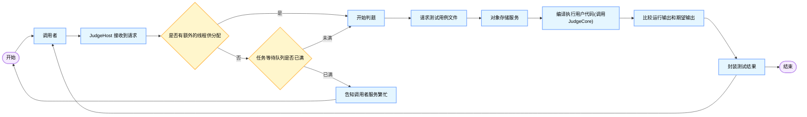
JudgeCore 的整体运行流程如下图所示，JudgeCore 首先接收并验证输入参数，包括：用户代码文件路径、输入文件路径、最长运行时间、最大内存占用量、最大输出长度等。然后，创建子进程用户执行用户代码。父进程等待子进程执行完毕，包括：正常，非正常返回，被监控者杀死等状态。子进程开始时，创建监控线程，限制子进程的运行时间。然后根据 JudgeCore 输入参数，设置时间、内存、输出限制，并重定向 stdin，stdout，stderr 到相应的文件中。同时，通过 seccomp 限制违规的系统调用。最后，执行用户代码输出运行结果。父进程继续执行，关闭监控线程，并将代码运行结果返回。

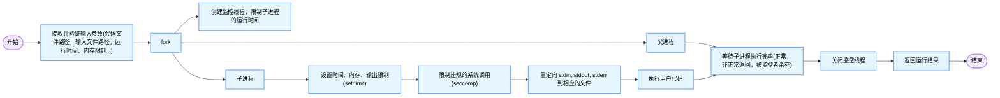
### 3.4 关键业务流程设计

#### 3.4.1 用户管理功能

##### 功能点 1：用户认证管理

###### 功能描述

实现用户账号的创建与登录验证，区分注册用户、游客和管理员的访问权限。

###### 执行流程

1. **注册流程**

   - 游客在登录页面点击“注册”，进入注册页面并填写用户名、邮箱、密码（长度 >8）等信息。
   - 前端验证密码格式后，向后端发送注册请求。
   - 后端校验用户名唯一性，生成用户唯一标识码，将注册信息存入用户数据库。
   - 注册成功后返回登录页面并提示成功。
   - **异常处理**：若密码格式错误或用户名已注册，前端显示对应警告，用户重新填写。
2. **登录流程**

   - 用户在登录页面输入用户名和密码，点击“登录”。
   - 后端验证用户名存在且密码正确，返回登录成功状态。
   - 前端获取登录状态，跳转至用户主页。
   - **异常处理**：用户名或密码错误时，前端提示错误信息，用户重新输入。

###### 流程图
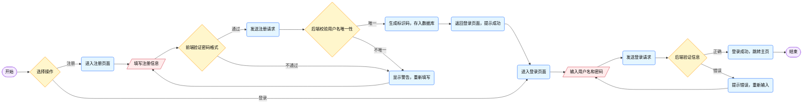

##### 功能点 2：个人信息管理

###### 功能描述

支持注册用户查看和修改个人信息，查询活跃状态（如评论、代码提交情况等）。

###### 执行流程

1. **查询个人信息/活跃状态**

   - 登录用户进入个人主页或点击刷新，前端向后端发送查询请求（含登录信息）。
   - 后端验证登录状态，从用户数据库查询个人信息或活跃状态（如发表的评论数、题解数、题目 AC 数等）。
   - 前端显示查询结果。
   - **异常处理**：若登录状态错误，清除登录状态，返回主页并提示。
2. **编辑个人信息**

   - 用户在个人主页点击“编辑”，进入编辑页面修改昵称、头像 URL、个人简介等信息。
   - 点击“提交”后，前端发送修改请求（含登录信息和新数据）。
   - 后端验证登录状态，更新用户数据库中的个人信息。
   - 前端显示修改成功，并通过“查询个人信息”流程刷新显示最新数据。

###### 流程图
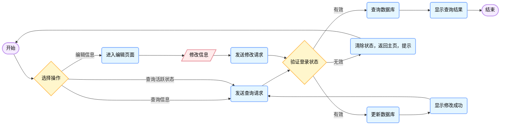

##### 功能点 3：用户权限管理

###### 功能描述

管理员对注册用户进行封禁、解封、赋予管理员权限等操作，维护系统秩序。

###### 执行流程

1. **用户管理操作**
   - 管理员进入用户管理模块，查看用户列表，选择目标用户及操作类型（封禁/解封/赋权）。
   - 点击确认后，前端发送操作请求（含管理员权限标识、目标用户 ID、操作类型）。
   - 后端验证管理员权限及操作合法性（如目标用户是否处于保护状态），更新用户数据库中的状态或权限字段（如 `is_admin` 标识、`disabled` 状态）。
   - 前端显示操作成功提示。
   - **异常处理**：若操作不合法（如无效操作类型、目标用户保护状态），前端提示错误，管理员重新选择。

###### 流程图
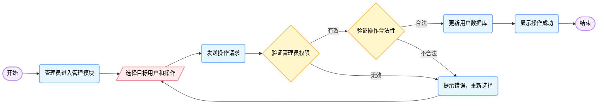

#### 3.4.2 题库功能

##### 功能点 4：题目浏览与提交

###### 功能描述

支持用户查看题目详情、题解、提交记录，提交代码进行评测。

###### 执行流程

1. **查看题目与题解**

   - 用户点击题目列表中的题目，前端发送题目 ID 及登录状态至后端。
   - 后端查询题目信息（标题、描述、难度、标签）及题解列表，若用户已登录，附加该题的提交记录。
   - 前端显示题目详情，未登录用户点击题解时弹出登录提醒，登录后加载题解内容。
   - **异常处理**：题目或题解不存在时，前端提示错误。
2. **提交代码与查看记录**

   - 登录用户在题目页面点击“提交代码”，上传代码内容，前端发送题目 ID、代码、用户 ID 至后端。
   - 后端验证题目存在及登录状态，将代码发送至评测服务器，记录提交信息（时间、语言、代码片段）。
   - 评测完成后，用户可在题目页面或个人中心查看提交记录（状态、耗时、内存使用等）。
   - **异常处理**：未登录用户需先登录；题目不存在时提示错误。

###### 流程图
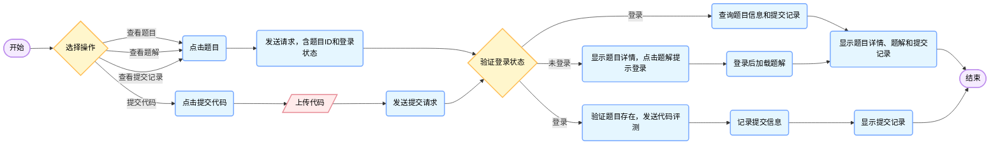

##### 功能点 5：题目与题解管理

###### 功能描述

允许有权限的用户上传、编辑、删除题目和题解，管理员审核新题目。

###### 执行流程

1. **题目上传与审核**

   - 注册用户点击“上传题目”，填写题目标题、描述、测试样例等信息，提交至后端存入待审核题库。
   - 管理员进入审核界面，查看待审核题目，依据标准（内容准确性、格式规范性）选择通过或驳回。
   - 审核通过后，题目状态更新为“已审核”，开放给用户；驳回时填写原因并通知提交者。
   - **异常处理**：未登录用户需先登录；审核时题目被撤回则终止流程。
2. **题目与题解编辑/删除**

   - 具备编辑权限的用户（如题目作者、管理员）进入题目管理界面，选择目标题目/题解，修改内容（如题目描述、题解步骤）后保存，后端验证格式并更新数据库。
   - 管理员或授权用户删除题目时，先验证是否存在关联活动，若允许则执行软删除（标记 `deleted` 字段），同时隐藏相关题解和提交记录。
   - **异常处理**：编辑时题目被其他用户锁定，提示“正在编辑中”；删除时存在关联活动则禁止操作。

###### 流程图
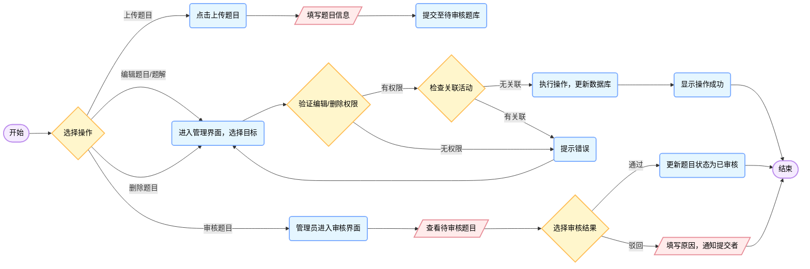

#### 3.4.3 论坛功能

##### 功能点 6：论坛互动

###### 功能描述

支持用户浏览帖子、发布内容、评论互动（点赞、回复、举报等）。

###### 执行流程

1. **帖子浏览与发布**

   - 用户进入论坛首页或板块，前端请求帖子列表（标题、作者、发布时间），点击具体帖子加载正文、评论等。
   - 登录用户点击“发布帖子”，填写标题、内容，后端验证格式后存入数据库，前端跳转至帖子详情页。
   - **异常处理**：游客仅能浏览公开帖子；发布时格式错误或内容过长，提示用户修改。
2. **评论与互动**

   - 用户在帖子下方评论区输入内容，点击“发布”，后端校验敏感词和长度，通过后存入评论表，并关联帖子 ID。
   - 对评论可执行点赞（记录点赞日志，更新点赞计数）、回复（生成子评论）、举报（触发审核流程），前端实时更新评论区。
   - **异常处理**：评论含敏感词时提示修改；网络中断时保存草稿，恢复后重新提交。

###### 流程图
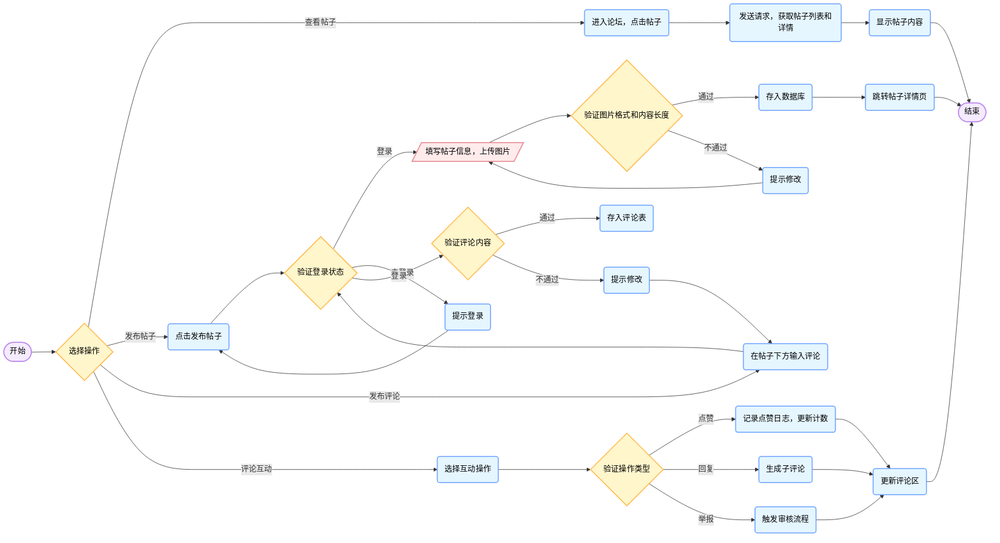

##### 功能点 7：论坛内容管理

###### 功能描述

帖子作者或管理员删除违规或无效的帖子及评论，维护社区秩序。

###### 执行流程

1. **删除帖子**

   - 作者或管理员在个人中心或管理后台选择目标帖子，点击“删除”。
   - 后端验证权限（作者或管理员）及帖子状态，软删除帖子及所有关联评论与互动记录。
   - 前端刷新页面，不再显示该帖子。
   - **异常处理**：权限不足或存在其他问题时，提示“无法删除”。
2. **删除评论**

   - 评论作者、帖子作者或管理员点击评论旁的“删除”，确认后后端验证权限，软删除评论及子回复，前端更新评论区。
   - **异常处理**：无删除权限时提示错误。

###### 流程图
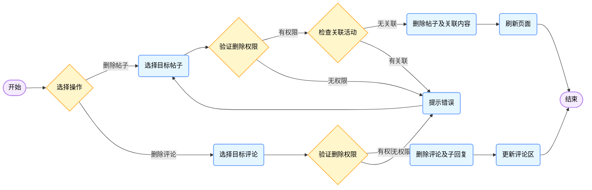

#### 3.4.4 AI 辅助功能

##### 功能点 8：LLM 交互功能

###### 功能描述

通过大语言模型提供题目推荐、题目分析、代码解释、审核辅助及论坛回复等智能功能。

###### 执行流程

1. **AI 推荐题目**

   - 用户点击按钮激活“智能推荐题目”功能，系统检查用户已完成题目数（≥5 题则分析历史行为和知识点，否则返回新手推荐）。
   - 拼接用户行为数据与推荐提示词，调用 AI 接口生成推荐题目难度和标签，后端检索匹配题目，前端显示推荐列表。
   - **异常处理**：AI 服务繁忙或无有效回复时，提示用户重试。
2. **AI 分析题目/解释代码**

   - 用户在题目详情页点击“AI 分析”，或在提交记录页点击“AI 解释”，系统提取题目内容或代码片段，拼接分析提示词后调用 AI 接口。
   - AI 返回分析结果（解题思路、代码逻辑解释），后端存储结果并前端展示，若已有历史分析则直接调取。
   - **异常处理**：同推荐题目。
3. **AI 辅助审核题目/回复**

   - 管理员审核题目时点击“AI 辅助”，系统发送题目内容至 AI 生成审核建议（如是否符合难度分级、是否存在歧义、测试样例是否合适等），辅助管理员决策。
   - 用户在评论中输入“@AI”触发回复功能，系统检查冷却时间（≥10 分钟），提取帖子上下文调用 AI 生成回复，以“@AI”账号发布新评论。
   - **异常处理**：高频请求时提示“请稍后重试”。

###### 流程图
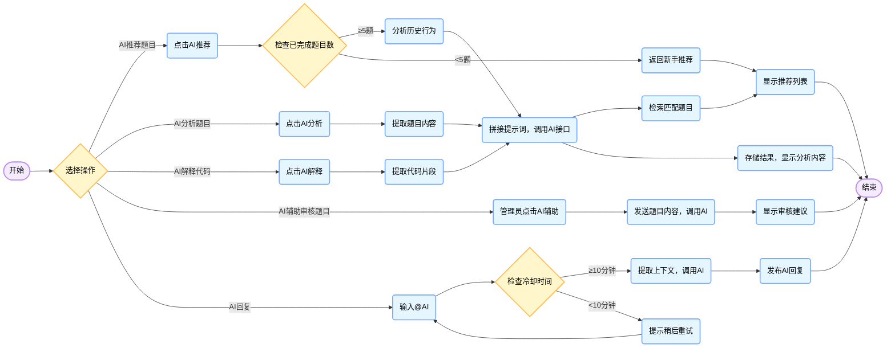

#### 3.4.5 公共功能流程设计

##### 前后端交互公共流程
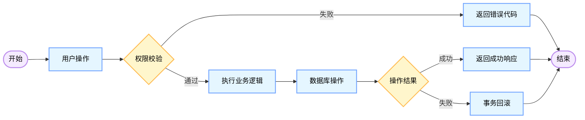

##### 权限控制

- **游客**：仅能查看题目（不含题解）、浏览公开帖子，无法进行提交、发布、互动操作。
- **注册用户**：具备完整的题目提交、题解查看、论坛发布与互动权限，但上传题目需审核，编辑/删除题目/题解需权限校验。
- **管理员**：拥有用户管理、题目审核、论坛内容管理（删除帖子/评论）等高级权限。

##### 异常处理通用规则

- 所有操作前校验用户登录状态，未登录或状态失效时引导至登录页面。
- 输入数据格式校验（如密码长度、图片大小、敏感词过滤）在前端和后端双重执行，确保数据合法性。
- 调用外部接口（如 AI 服务）时，处理网络超时、服务不可用等异常，提示用户重试并记录日志。

## 4 数据库设计

### 4.1 ER 图设计

上图为数据库设计的 ER 图，图中连线标识了各个数据表之间的依赖关系。在设计数据库的过程中，我们首先确定系统的应用目标和功能要求，分析用户的数据、应用需求，根据需求的分析结果确定数据的存储结构和处理方式。

在设计数据库的过程中，我们主要考虑了以下因素：数据库表应具有规范的命名方式，字段名应具有明确的含义；数据库表之间应具有明确的关联关系，外键约束应设置，以保证数据一致性；应根据业务需求合理设计索引以提高查询性能；数据库的安全性应得到保障，密码等敏感信息应加密存储。

此外，数据库表单设计的时候，我们强调了第三范式的应用：第三范式（Third Normal Form，3NF）是指在满足第二范式（2NF）的基础上，消除非主属性对主键的传递依赖关系。也就是说，每个非主属性都只依赖于主键，而不依赖于其他非主属性。在数据库设计中，遵循第三范式有助于减少数据冗余，提高数据存储和更新的效率，增加数据一致性和可维护性。但是，有时为了提高查询效率，需要在一定程度上冗余数据，此时就需要根据具体情况权衡使用第三范式或非正式范式。

在实际应用中，可以通过以下方法来遵循第三范式：

- 识别主键及其依赖项：确定表中的主键，并确定其他属性是否完全依赖于主键，如果不是，则需要进行分解；
- 分解非主属性：将非主属性分解为多个表，并将每个表中的主键作为外键引用原始表的主键，确保每个表中的属性都只依赖于主键；
- 使用外键引用：使用外键引用确保关系表的属性只依赖于主键，从而避免数据冗余和更新异常。

遵循第三范式可以有效地减少数据冗余，提高数据存储和更新的效率，但是在设计数据库时需要根据实际情况权衡使用第三范式或非正式范式，以满足业务需求和查询效率。

### 4.2 物理数据模型

根据 DeepCode 系统的逻辑结构设计，对应的物理数据模型如下所示，包括：表结构定义、字段类型选择、索引创建等内容。接下来将详细介绍各个实体对应的表结构及其实现细节。

#### 4.2.1 User（用户）

该表详细描述了系统中“用户”实体的各个属性及其特性，包括“普通用户”和“管理员”。

<table>
<tr>
<td>名称 </td><td>类型 </td><td>不是null </td><td>主键 </td><td>索引 </td><td>注释 </td></tr>
<tr>
<td>id </td><td>int </td><td>是 </td><td>是 </td><td>primary key </td><td>用户id </td></tr>
<tr>
<td>email </td><td>varchar(255) </td><td>是 </td><td> </td><td>unique </td><td>用户邮箱 </td></tr>
<tr>
<td>password </td><td>varchar(255)  </td><td>是 </td><td> </td><td> </td><td>用户密码 </td></tr>
<tr>
<td>nickname </td><td>varchar(255) </td><td>是 </td><td> </td><td> </td><td>用户昵称 </td></tr>
<tr>
<td>avatar </td><td>varchar(1020) </td><td>是 </td><td> </td><td> </td><td>用户头像url </td></tr>
<tr>
<td>is_admin </td><td>tinyint(1) </td><td>是 </td><td> </td><td> </td><td>是否为管理员（0：普通用户，1：管理员） </td></tr>
<tr>
<td>description </td><td>varchar(1275) </td><td> </td><td> </td><td> </td><td>用户个人简介 </td></tr>
</table>

#### 4.2.2 Follow（用户关注列表）

该表记录了不同用户之间的“关注”关系。

<table>
<tr>
<td>名称 </td><td>类型 </td><td>不是null </td><td>主键 </td><td>索引 </td><td>注释 </td></tr>
<tr>
<td>id </td><td>int </td><td>是 </td><td>是 </td><td>primary key </td><td>关注列表id </td></tr>
<tr>
<td>follower_id </td><td>int </td><td>是 </td><td> </td><td> </td><td>关注者id </td></tr>
<tr>
<td>followee_id </td><td>int </td><td>是 </td><td> </td><td> </td><td>被关注者id </td></tr>
<tr>
<td>create_time </td><td>datetime </td><td>是 </td><td> </td><td> </td><td>关注日期 </td></tr>
</table>

#### 4.2.3 Question（题目）

该表详细描述了系统中“题目”实体的各个属性及其特性。

<table>
<tr>
<td>名称 </td><td>类型 </td><td>不是null </td><td>主键 </td><td>索引 </td><td>注释 </td></tr>
<tr>
<td>id </td><td>int </td><td>是 </td><td>是 </td><td>primary key </td><td>题目id </td></tr>
<tr>
<td>title </td><td>varchar(255) </td><td>是 </td><td> </td><td>normal </td><td>题目标题 </td></tr>
<tr>
<td>content </td><td>varchar(2550) </td><td>是 </td><td> </td><td> </td><td>题目内容 </td></tr>
<tr>
<td>difficulty </td><td>int </td><td>是 </td><td> </td><td> </td><td>题目难度（1：简单，2：中等，3：困难） </td></tr>
<tr>
<td>deleted </td><td>tinyint(1) </td><td>是 </td><td> </td><td> </td><td>是否删除（0：未删除，1：已删除） </td></tr>
</table>

#### 4.2.4 TestCase（测试用例）

该表记录了每个“题目”所拥有的“测试用例”信息。

<table>
<tr>
<td>名称 </td><td>类型 </td><td>不是null </td><td>主键 </td><td>索引 </td><td>注释 </td></tr>
<tr>
<td>id </td><td>int </td><td>是 </td><td>是 </td><td>primary key </td><td>测试用例id </td></tr>
<tr>
<td>question_id </td><td>int </td><td>是 </td><td> </td><td> </td><td>题目id </td></tr>
<tr>
<td>input </td><td>varchar(1020) </td><td>是 </td><td> </td><td> </td><td>输入文件url </td></tr>
<tr>
<td>output </td><td>varchar(1020) </td><td>是 </td><td> </td><td> </td><td>期望输出文件url </td></tr>
</table>

#### 4.2.5 QuestionTag（题目标签）

该表记录了所有“题目标签”种类，例如：动态规划、深度优先搜索...

<table>
<tr>
<td>名称 </td><td>类型 </td><td>不是null </td><td>主键 </td><td>索引 </td><td>注释 </td></tr>
<tr>
<td>id </td><td>int </td><td>是 </td><td>是 </td><td>primary key </td><td>题目标签id </td></tr>
<tr>
<td>name </td><td>varchar(255) </td><td>是 </td><td> </td><td> </td><td>题目标签名称 </td></tr>
</table>

#### 4.2.6 QuestionTagMap（题目标签映射）

该表记录了每道“题目”所拥有的“题目标签”信息。

<table>
<tr>
<td>名称 </td><td>类型 </td><td>不是null </td><td>主键 </td><td>索引 </td><td>注释 </td></tr>
<tr>
<td>id </td><td>int </td><td>是 </td><td>是 </td><td>primary key </td><td>题目标签映射id </td></tr>
<tr>
<td>question_id </td><td>int </td><td>是 </td><td> </td><td> </td><td>题目id </td></tr>
<tr>
<td>tag_id </td><td>int </td><td>是 </td><td> </td><td> </td><td>题目标签id </td></tr>
</table>

#### 4.2.7 Record（提交记录）

该表记录了“用户”每次提交代码的测评结果。

<table>
<tr>
<td>名称 </td><td>类型 </td><td>不是null </td><td>主键 </td><td>索引 </td><td>注释 </td></tr>
<tr>
<td>id </td><td>int </td><td>是 </td><td>是 </td><td>primary key </td><td>提交记录id </td></tr>
<tr>
<td>user_id </td><td>int </td><td>是 </td><td> </td><td> </td><td>用户id </td></tr>
<tr>
<td>question_id </td><td>int </td><td>是 </td><td> </td><td> </td><td>题目id </td></tr>
<tr>
<td>lang_id </td><td>int </td><td>是 </td><td> </td><td> </td><td>编程语言id </td></tr>
<tr>
<td>submit_code </td><td>varchar(2550) </td><td>是 </td><td> </td><td> </td><td>提交的代码 </td></tr>
<tr>
<td>result </td><td>int </td><td>是 </td><td> </td><td> </td><td>测试结果（0：ACCEPT，1：WRONG_ANSWER，2：RUNTIME_ERROR，3：TIME_LIMIT_EXCEED，4：MEMORY_LIMIT_EXCEED，5：OUTPUT_LIMIT_EXCEED，6：SEGMENTATION_FAULT，7：FLOAT_ERROR，8：UNKNOWN_ERROR，9：INPUT_FILE_NOT_FOUND，10：CAN_NOT_MAKE_OUTPUT，11：SET_LIMIT_ERROR，12：NOT_ROOT_USER，13：FORK_ERROR，14：CREATE_THREAD_ERROR，15：VALIDATE_ERROR，16：COMPILE_ERROR） </td></tr>
<tr>
<td>runtime </td><td>int </td><td> </td><td> </td><td> </td><td>执行时长（ms） </td></tr>
<tr>
<td>memory </td><td>float </td><td> </td><td> </td><td> </td><td>占用内存（MB） </td></tr>
<tr>
<td>submit_time </td><td>datetime </td><td>是 </td><td> </td><td> </td><td>提交日期 </td></tr>
<tr>
<td>extra_info </td><td>varchar(1275) </td><td> </td><td> </td><td> </td><td>附加信息 </td></tr>
<tr>
<td>test_case_total_num </td><td>int </td><td>是 </td><td> </td><td> </td><td>测试用例总数 </td></tr>
<tr>
<td>test_case_passed_num </td><td>int </td><td>是 </td><td> </td><td> </td><td>测试用例通过数 </td></tr>
</table>

#### 4.2.8 Language（编程语言）

该表记录了每种“编程语言”。

<table>
<tr>
<td>名称 </td><td>类型 </td><td>不是null </td><td>主键 </td><td>索引 </td><td>注释 </td></tr>
<tr>
<td>id </td><td>int </td><td>是 </td><td>是 </td><td>primary key </td><td>编程语言id </td></tr>
<tr>
<td>name </td><td>varchar(255) </td><td>是 </td><td> </td><td> </td><td>编程语言名称 </td></tr>
</table>

#### 4.2.9 Solution（题解）

该表详细描述了“用户”发布的“题解”中所包含的各个属性及其特征。

<table>
<tr>
<td>名称 </td><td>类型 </td><td>不是null </td><td>主键 </td><td>索引 </td><td>注释 </td></tr>
<tr>
<td>id </td><td>int </td><td>是 </td><td>是 </td><td>primary key </td><td>题解id </td></tr>
<tr>
<td>question_id </td><td>int </td><td>是 </td><td> </td><td> </td><td>问题id </td></tr>
<tr>
<td>author_id </td><td>int </td><td>是 </td><td> </td><td> </td><td>用户作者id </td></tr>
<tr>
<td>title </td><td>varchar(255) </td><td>是 </td><td> </td><td>normal </td><td>标题 </td></tr>
<tr>
<td>content </td><td>varchar(2550) </td><td>是 </td><td> </td><td> </td><td>内容 </td></tr>
<tr>
<td>like_num </td><td>int </td><td>是 </td><td> </td><td> </td><td>点赞数 </td></tr>
<tr>
<td>view_num </td><td>int </td><td>是 </td><td> </td><td> </td><td>浏览量 </td></tr>
<tr>
<td>create_time </td><td>datetime </td><td>是 </td><td> </td><td> </td><td>创建日期 </td></tr>
<tr>
<td>deleted </td><td>tinyint(1) </td><td>是 </td><td> </td><td> </td><td>是否删除（0：未删除，1：已删除） </td></tr>
</table>

#### 4.2.10 SolutionTag（题解标签）

该表记录了所有“题解标签”种类，例如：C++、回溯...

<table>
<tr>
<td>名称 </td><td>类型 </td><td>不是null </td><td>主键 </td><td>索引 </td><td>注释 </td></tr>
<tr>
<td>id </td><td>int </td><td>是 </td><td>是 </td><td>primary key </td><td>题解标签id </td></tr>
<tr>
<td>name </td><td>varchar(255) </td><td>是 </td><td> </td><td> </td><td>题解标签名称 </td></tr>
</table>

#### 4.2.11 SolutionTagMap（题解标签映射）

该表记录了每篇“题解”所拥有的“题解标签”信息。

<table>
<tr>
<td>名称 </td><td>类型 </td><td>不是null </td><td>主键 </td><td>索引 </td><td>注释 </td></tr>
<tr>
<td>id </td><td>int </td><td>是 </td><td>是 </td><td>primary key </td><td>题解标签映射id </td></tr>
<tr>
<td>solution_id </td><td>int </td><td>是 </td><td> </td><td> </td><td>题解id </td></tr>
<tr>
<td>tag_id </td><td>int </td><td>是 </td><td> </td><td> </td><td>题解标签id </td></tr>
</table>

#### 4.2.12 SolutionLike（题解点赞）

该表记录了“用户”对每篇题解进行“点赞”的信息。

<table>
<tr>
<td>名称 </td><td>类型 </td><td>不是null </td><td>主键 </td><td>索引 </td><td>注释 </td></tr>
<tr>
<td>id </td><td>int </td><td>是 </td><td>是 </td><td>primary key </td><td>题解点赞id </td></tr>
<tr>
<td>user_id </td><td>int </td><td>是 </td><td> </td><td> </td><td>用户id </td></tr>
<tr>
<td>solution_id </td><td>int </td><td>是 </td><td> </td><td> </td><td>题解id </td></tr>
</table>

#### 4.2.13 SolutionComment（题解评论）

该表记录了“用户”对每篇题解进行“评论”的信息，以及“评论”的详细内容。

<table>
<tr>
<td>名称 </td><td>类型 </td><td>不是null </td><td>主键 </td><td>索引 </td><td>注释 </td></tr>
<tr>
<td>id </td><td>int </td><td>是 </td><td>是 </td><td>primary key </td><td>题解评论id </td></tr>
<tr>
<td>user_id </td><td>int </td><td>是 </td><td> </td><td> </td><td>用户id </td></tr>
<tr>
<td>solution_id </td><td>int </td><td>是 </td><td> </td><td> </td><td>题解id </td></tr>
<tr>
<td>content </td><td>varchar(510) </td><td>是 </td><td> </td><td> </td><td>评论内容 </td></tr>
<tr>
<td>submit_time </td><td>datetime </td><td>是 </td><td> </td><td> </td><td>评论日期 </td></tr>
</table>

#### 4.2.14 Discussion（讨论）

该表详细描述了“用户”发布的“讨论”中所包含的各个属性及其特征。

<table>
<tr>
<td>名称 </td><td>类型 </td><td>不是null </td><td>主键 </td><td>索引 </td><td>注释 </td></tr>
<tr>
<td>id </td><td>int </td><td>是 </td><td>是 </td><td>primary key </td><td>讨论id </td></tr>
<tr>
<td>user_id </td><td>int </td><td>是 </td><td> </td><td> </td><td>用户id </td></tr>
<tr>
<td>title </td><td>varchar(255) </td><td>是 </td><td> </td><td>normal </td><td>标题 </td></tr>
<tr>
<td>content </td><td>varchar(2550) </td><td>是 </td><td> </td><td> </td><td>内容 </td></tr>
<tr>
<td>view_num </td><td>int </td><td>是 </td><td> </td><td> </td><td>浏览量 </td></tr>
<tr>
<td>create_time </td><td>datetime </td><td>是 </td><td> </td><td> </td><td>创建日期 </td></tr>
<tr>
<td>deleted </td><td>tinyint(1) </td><td>是 </td><td> </td><td> </td><td>是否删除（0：未删除，1：已删除） </td></tr>
</table>

#### 4.2.15 DiscussionLike（讨论点赞）

该表记录了“用户”对每篇讨论进行“点赞”的信息。

<table>
<tr>
<td>名称 </td><td>类型 </td><td>不是null </td><td>主键 </td><td>索引 </td><td>注释 </td></tr>
<tr>
<td>id </td><td>int </td><td>是 </td><td>是 </td><td>primary key </td><td>讨论点赞id </td></tr>
<tr>
<td>user_id </td><td>int </td><td>是 </td><td> </td><td> </td><td>用户id </td></tr>
<tr>
<td>discussion_id </td><td>int </td><td>是 </td><td> </td><td> </td><td>讨论id </td></tr>
</table>

#### 4.2.16 DiscussionComment（讨论评论）

该表记录了“用户”对每篇讨论进行“评论”的信息，以及“评论”的详细内容。

<table>
<tr>
<td>名称 </td><td>类型 </td><td>不是null </td><td>主键 </td><td>索引 </td><td>注释 </td></tr>
<tr>
<td>id </td><td>int </td><td>是 </td><td>是 </td><td>primary key </td><td>讨论评论id </td></tr>
<tr>
<td>user_id </td><td>int </td><td>是 </td><td> </td><td> </td><td>用户id </td></tr>
<tr>
<td>discussion_id </td><td>int </td><td>是 </td><td> </td><td> </td><td>讨论id </td></tr>
<tr>
<td>content </td><td>varchar(510) </td><td>是 </td><td> </td><td> </td><td>评论内容 </td></tr>
<tr>
<td>submit_time </td><td>datetime </td><td>是 </td><td> </td><td> </td><td>评论日期 </td></tr>
</table>

## 5 系统部署设计

### 5.1 服务器配置

#### 5.1.1 生产环境

考虑到应用用户群体规模，集成 Web、应用、数据库及缓存至一台云服务器，配置如下：

- 处理器：8 核以上，主频 2.4GHz 以上
- 内存：32GB 以上。
- 硬盘：4TB 以上。
- 操作系统：Ubuntu 22.04 LTS

#### 5.1.2 开发与测试环境

开发和测试环境使用较低配置的虚拟机或云主机：

- 处理器：2 核以上，主频 2.4GHz 以上
- 内存：8GB 以上。
- 硬盘：200GB 以上。
- 操作系统：Ubuntu 22.04 LTS

### 5.2 网络拓扑

- 内网通信：所有内部服务通过内网 IP 地址通信，并使用防火墙限制访问。
- CDN 加速：静态资源（如图片、CSS、JS 文件）通过 CDN 分发。
- DNS 解析：使用 DNS 服务进行域名解析。

### 5.3 安全性设计

- HTTPS：所有外部通信强制使用 HTTPS 协议。
- 身份认证：使用 OAuth 2.0 或 JWT 进行用户身份认证。
- 输入校验：对用户提交的数据进行严格校验，防止 SQL 注入、XSS 攻击等。
- 沙箱隔离：代码评测在独立的 Docker 容器中运行，限制资源使用（CPU 时间、内存大小等）。
- 防火墙：配置防火墙规则，仅允许必要的端口开放。
- 定期备份：每日备份数据库，并存储在异地。

### 5.4 监控与报警

#### 5.4.1 监控指标：

- 系统性能：CPU 使用率、内存使用率、磁盘 I/O 等。
- 应用性能：接口响应时间、错误率、QPS 等。
- 数据库性能：查询延迟、连接数等。

#### 5.4.2 报警机制：

- 当 CPU 使用率超过 80% 或内存使用率超过 80% 时触发报警。
- 当接口错误率超过 1% 时触发报警。
- 当数据库查询延迟超过 15 秒时触发报警。

#### 5.4.3 工具：

- 使用 Prometheus 收集监控数据。
- 使用 Grafana 展示监控数据。
- 使用 PagerDuty 或钉钉机器人发送报警通知。

### 5.5 部署流程

- 代码构建：通过 Gitlab CI/CD 工具自动构建代码并生成 Docker 镜像。
- 镜像推送：将生成的镜像推送到私有镜像仓库。
- 容器部署：使用 Kubernetes 部署服务，配置自动扩缩容策略。
- 回滚机制：若新版本出现问题，可通过 Kubernetes 快速回滚到上一版本。
